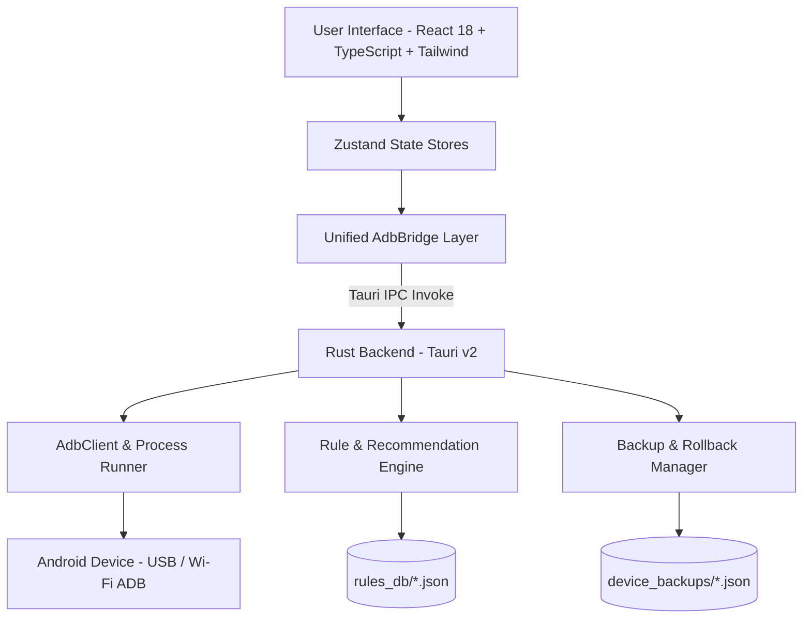

<div align="center">

  

  # ⚡ NexusTweak
  ### Modern, Safe & High-Performance Android ADB Optimization & Management Suite
  *Modern, Güvenli ve Yüksek Performanslı Android ADB Optimizasyon ve Yönetim Aracı*

  <p align="center">
    <strong><a href="#-english">🇬🇧 English</a></strong> •
    <strong><a href="./README.tr.md">🇹🇷 Türkçe (Turkish)</a></strong>
  </p>

  [](https://opensource.org/licenses/MIT)
  [](https://v2.tauri.app/)
  [](https://www.rust-lang.org/)
  [](https://react.dev/)
  [](https://www.typescriptlang.org/)
  [](https://tailwindcss.com/)
  [](https://github.com/burakzdgn/NexusTweak)

  <p align="center">
    <a href="#-key-features">Key Features</a> •
    <a href="#-supported-oem-presets">OEM Presets</a> •
    <a href="#-architecture">Architecture</a> •
    <a href="#-quick-start">Quick Start</a> •
    <a href="#-safety--rollback-philosophy">Safety & Rollback</a> •
    <a href="#-contributing">Contributing</a>
  </p>

</div>

---

<a name="english"></a>
## 📖 Overview

**NexusTweak** is an open-source, modern, and high-performance desktop application designed to diagnose, optimize, and debloat Android devices via USB or Wireless (Wi-Fi) ADB.

Built with **Tauri v2 (Rust)** and a **React 18 + TypeScript + Tailwind CSS** interface, it enables users to identify deep hardware telemetry, apply manufacturer-tailored performance tweaks, safely disable unnecessary OEM background bloatware, inspect exact before/after settings diffs, and perform 1-click rollbacks using automated snapshot backups.

---

## ✨ Key Features

### 🔍 1. Deep Hardware & Telemetry Diagnostics
- **SoC & Processor:** Chipset model, CPU ABI architecture (`arm64-v8a`), device codename, manufacturer, and build ID.
- **Display Telemetry:** Panel resolution, pixel density (DPI), active refresh rate, and dynamic refresh rate levels (60Hz / 90Hz / 120Hz / 144Hz).
- **Battery & Thermal Monitoring:** Live `dumpsys battery` extraction for core battery temperature (°C), voltage (V), health state, and power source.
- **Security & System Status:** Root detection (Magisk/KernelSU), SELinux enforcement level (*Enforcing/Permissive*), Android & SDK release, and security patch date.

### ⚡ 2. Rule & Optimization Engine
- **UI & Motion Fluidity:** Scale window, transition, and animator durations down to `0.5x` or `0.0x` for instantaneous system responsiveness.
- **120Hz/144Hz Lock:** Force peak refresh rates by locking `min_refresh_rate` to `peak_refresh_rate` to eliminate scrolling micro-stutters.
- **Encrypted & Ad-Blocking DNS:** 1-click configuration of Cloudflare (1.1.1.1 DoH) or AdGuard Ad-Blocking (DoT) DNS.
- **Standby Battery Savings:** Aggressive Doze idle parameter tuning to enter deep sleep faster when the screen is turned off.
- **Wi-Fi Latency Tuning:** Optimize Wi-Fi scan throttling for low-latency network handoffs.

### 🗑️ 3. Safe Debloat Hub
- **Risk Classification:**
  - 🟢 **Safe:** Pure background advertisements, promotional pushers, and usage analytics.
  - 🟡 **Moderate:** Manufacturer-specific feature stubs (Samsung Pay, Game Optimizing Service, etc.).
  - 🔴 **Advanced:** Packages requiring careful consideration before modification.
- **Non-Destructive Removal:** Uses `--user 0` isolation to safely disable apps without altering system read-only partitions.
- **Bulk Action Bar:** Floating action toolbar to apply or debloat multiple selected items simultaneously.

### 🛡️ 4. 1-Click Rollback & Detailed Diff Inspector
- **Automatic State Snapshots:** Every tweak or debloat action automatically captures device name, formatted timestamp, and exact global/system/secure settings values into `device_backups/<device_id>_<timestamp>.json`.
- **Detailed Diff Viewer:** Inspects precisely what settings and packages will be restored before executing a rollback.
- **System Whitelist Protection:** Strict safety barrier preventing accidental deletion of vital OS packages (`SystemUI`, `Launcher`, `Dialer`, `Play Services`, `Settings`, `KeyChain`).

### 💻 5. Interactive ADB Shell Drawer & Quick Presets
- Top-right **Terminal Console** button triggers a slide-up terminal drawer on any screen.
- Real-time ANSI colored execution stream and 1-click diagnostic command presets (`dumpsys battery`, `wm size`, `getprop`, `pm list`).

### ⬇️ 6. 1-Click Google ADB Platform-Tools Downloader
- Detects if ADB is missing on the system and automatically downloads official Google platform-tools archives directly into `binaries/platform-tools/`.

### 🌐 7. Multi-Language Localization (i18n)
- Seamless real-time language switching between **English (EN)** and **Türkçe (TR)**.

---

## 📱 Supported OEM Presets

| Manufacturer / UI | Pre-configured Debloat & Tweaks | Risk Level | Status |
| :--- | :--- | :--- | :---: |
| **Samsung One UI** | Bixby Voice/Agent, GOS Bypass, Knox Analytics, RAM Plus Disable, Samsung Pay | `Safe` / `Moderate` | ✅ Supported |
| **Xiaomi HyperOS / MIUI** | MSA (System Ads), Joyose Throttler, GetApps Store, Wallpaper Carousel, Mi Video | `Safe` / `Moderate` | ✅ Supported |
| **Google Pixel** | Pixel Tips, Sound Search/Now Playing, Device Health Services, Columbus Gestures | `Safe` / `Moderate` | ✅ Supported |
| **Generic Android AOSP** | 0.5x Animations, 120Hz Force Peak, AdGuard/Cloudflare DNS, Aggressive Doze | `Safe` / `Moderate` | ✅ Supported |

---

## 🏗️ Architecture



---

## 🚀 Quick Start

### Prerequisites
- [Node.js](https://nodejs.org/) (v18 or higher)
- [Rust & Cargo](https://www.rust-lang.org/tools/install) (Required for compiling Tauri v2 desktop app)
- Android device with **Developer Options** and **USB Debugging** enabled.

### 1. Clone the Repository
```bash
git clone https://github.com/burakzdgn/NexusTweak.git
cd NexusTweak
```

### 2. Install Dependencies
```bash
npm install
```

### 3. Run in Development Mode

#### Web Preview Mode
```bash
npm run dev
```
> Open `http://localhost:1420` in your web browser.

#### Desktop Application Mode (Tauri + Rust Backend)
```bash
npm run tauri dev
```

### 4. Build Production Desktop Installer
```bash
npm run tauri build
```
> Generated binary packages (`.msi`, `.exe`, `.dmg`, `.deb`) will be located in `src-tauri/target/release/bundle/`.

---

## 🔒 Safety & Rollback Philosophy

> [!IMPORTANT]
> NexusTweak is engineered with **Safety-First** principles:
> 1. **Non-Destructive:** Packages are disabled using `pm disable-user --user 0` and `pm uninstall -k --user 0`, keeping the original ROM image intact.
> 2. **Pre-Action Snapshots:** Every tweak or batch operation automatically saves a timestamped JSON state dump.
> 3. **Immutable Whitelist:** Core operating system services required for device booting and telephony cannot be disabled.

---

## 📁 Repository Structure

```
NexusTweak/
├── src-tauri/                 # Rust Backend (Tauri v2)
│   ├── Cargo.toml             # Rust dependencies
│   ├── tauri.conf.json        # Tauri configuration & window security
│   ├── rules_db/              # OEM and Generic optimization JSON databases
│   │   ├── generic_tweaks.json
│   │   ├── samsung_oneui.json
│   │   ├── xiaomi_miui.json
│   │   ├── google_pixel.json
│   │   └── system_whitelist.json
│   └── src/
│       ├── main.rs            # Windows subsystem entry point
│       ├── lib.rs             # Tauri command invoke handlers
│       ├── models.rs          # Strongly-typed data structs
│       ├── adb/               # ADB client, command executor, scanner
│       └── rules/             # Rule engine, snapshot creator & rollback manager
├── src/                       # Frontend (React 18 + TypeScript + Tailwind)
│   ├── components/
│   │   ├── dashboard/         # Specs card, metric gauges, battery, score
│   │   ├── tweaks/            # Tweak cards, category & risk filters
│   │   ├── debloat/           # Package manager table, whitelist modal
│   │   ├── backup/            # Backup timeline, detailed snapshot diff modal
│   │   ├── terminal/          # Terminal view & slide-up terminal drawer
│   │   ├── settings/          # Wi-Fi pairing, ADB path & installer
│   │   └── layout/            # Sidebar, Header, BatchActionBar
│   ├── i18n/                  # Multi-language translation dictionaries (TR / EN)
│   ├── stores/                # Zustand state stores
│   ├── services/              # AdbBridge IPC client
│   └── App.tsx                # Main application shell
```

---

## 🤝 Contributing

Contributions are welcome!
1. Fork the repository (`Fork`).
2. Create your feature branch (`git checkout -b feature/NewFeature`).
3. Commit your changes (`git commit -m 'feat: add new OEM optimization rules'`).
4. Push to the branch (`git push origin feature/NewFeature`).
5. Open a **Pull Request (PR)**.

To add new optimization rules for an OEM, simply add a structured rule entry into the appropriate JSON file under `src-tauri/rules_db/`.

---

## 📄 License

This project is licensed under the [MIT License](LICENSE).

---

<div align="center">
  <sub>Take full control of your Android device. Designed with precision for power users and the open-source community.</sub>
</div>
