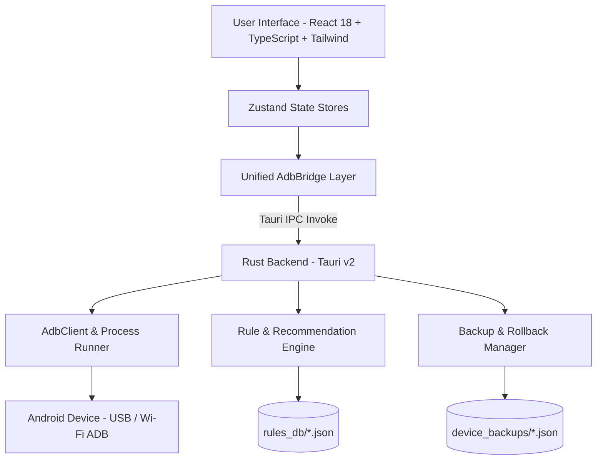

<div align="center">

  

  # ⚡ NexusTweak
  ### Modern, Safe & High-Performance Android ADB Optimization & Management Suite
  *Modern, Güvenli ve Yüksek Performanslı Android ADB Optimizasyon ve Yönetim Aracı*

  <p align="center">
    <strong><a href="#-english">🇬🇧 English</a></strong> •
    <strong><a href="./README.tr.md">🇹🇷 Türkçe (Turkish)</a></strong>
  </p>

  [](https://opensource.org/licenses/MIT)
  [](https://v2.tauri.app/)
  [](https://www.rust-lang.org/)
  [](https://react.dev/)
  [](https://www.typescriptlang.org/)
  [](https://tailwindcss.com/)
  [](https://github.com/burakzdgn/NexusTweak)

  <p align="center">
    <a href="#-key-features">Key Features</a> •
    <a href="#-disclaimer-of-liability">Disclaimer</a> •
    <a href="#-supported-oem-presets">OEM Presets</a> •
    <a href="#-architecture">Architecture</a> •
    <a href="#-quick-start">Quick Start</a> •
    <a href="#-safety--rollback-philosophy">Safety & Rollback</a> •
    <a href="#-contributing">Contributing</a>
  </p>

</div>

---

<a name="english"></a>
## ⚠️ Disclaimer of Liability

> [!CAUTION]
> **USE AT YOUR OWN RISK.**
> NexusTweak provides powerful low-level Android ADB commands, system property tuning, screen resolution modifications (`wm size` / `wm density`), and package debloating.
> - All optimizations and debloat operations are performed solely at the user's own discretion and risk.
> - The developers and contributors of NexusTweak assume **NO RESPONSIBILITY OR LIABILITY** for any direct or indirect damage, data loss, bootloops, system instability, or voided device warranties.
> - Always maintain independent data backups and verify rollback snapshots before making extensive modifications.

---

## 📖 Overview

**NexusTweak** is an open-source, modern, and high-performance desktop application designed to diagnose, optimize, debloat, and manage Android devices via USB or Wireless (Wi-Fi) ADB.

Built with **Tauri v2 (Rust backend)** and a **React 18 + TypeScript + Tailwind CSS** interface, it delivers deep hardware telemetry, 1-click optimization profiles, batch APK installation & extraction, display resolution & DPI customization, and automated rollback snapshots.

---

## ✨ Key Features

### ⚡ 1. One-Click Optimization Profiles (Phase 1)
- **🎮 Gaming & Ultra Performance:** Instant 0.0x animations, 120Hz/144Hz refresh rate lock, GOS/Joyose throttling bypass, and Cloudflare gaming DNS.
- **🔋 Extreme Battery Saver:** 60Hz lock, aggressive Doze deep sleep standby tuning, Wi-Fi scan throttling, background analytics suspension.
- **🛡️ Ultra Privacy & Clean:** AdGuard Encrypted DoT DNS, telemetry daemons isolation, lockscreen ad carousels deactivation.
- **⚖️ Balanced Daily Driver:** 0.5x responsive UI transitions, adaptive dynamic Hz, and Cloudflare privacy DNS.

### 📦 2. Advanced APK Management Suite (Phase 2)
- **Batch APK Installer:** Drag-and-drop multiple `.apk` files to install them seamlessly to user 0.
- **APK Extractor / Dumper:** Search installed applications and dump raw base `.apk` files directly to your computer (`extracted_apks/`).

### 🖥️ 3. Screen Resolution & DPI Customizer (Phase 3)
- **Resolution Tuning (`wm size`):** Switch between FHD+ (1080p), QHD+ (1440p), HD+ (720p), or custom width × height to reduce GPU load and battery drain.
- **DPI Density Scaling (`wm density`):** Scale interface density or force dual-column **Tablet Mode** in apps with 1-click Reset to Native resolution/density.

### 🔍 4. Deep Hardware & Telemetry Diagnostics
- **SoC & Processor:** Chipset model, CPU ABI architecture (`arm64-v8a`), device codename, manufacturer, and build ID.
- **Display Telemetry:** Panel resolution, pixel density (DPI), active refresh rate, and dynamic refresh rate levels (60Hz / 90Hz / 120Hz / 144Hz).
- **Battery & Thermal Monitoring:** Live `dumpsys battery` extraction for core battery temperature (°C), voltage (V), health state, and power source.
- **Security & System Status:** Root detection (Magisk/KernelSU), SELinux enforcement level (*Enforcing/Permissive*), Android & SDK release, and security patch date.

### 🗑️ 5. Safe Debloat Hub
- **Risk Classification:** Safe, Moderate, and Advanced risk tier categorization.
- **Non-Destructive Removal:** Uses `--user 0` isolation to safely disable apps without altering system read-only partitions.
- **Bulk Action Bar:** Floating action toolbar to apply or debloat multiple selected items simultaneously.

### 🛡️ 6. 1-Click Rollback & Detailed Diff Inspector
- **Automatic State Snapshots:** Every tweak or debloat action automatically captures device name, formatted timestamp, and exact global/system/secure settings values into `device_backups/<device_id>_<timestamp>.json`.
- **Detailed Diff Viewer:** Inspects precisely what settings and packages will be restored before executing a rollback.
- **System Whitelist Protection:** Strict safety barrier preventing accidental deletion of vital OS packages (`SystemUI`, `Launcher`, `Dialer`, `Play Services`, `Settings`, `KeyChain`).

### 💻 7. Interactive ADB Shell Drawer & Quick Presets
- Top-right **Terminal Console** button triggers a slide-up terminal drawer on any screen.
- Real-time ANSI colored execution stream and 1-click diagnostic command presets (`dumpsys battery`, `wm size`, `getprop`, `pm list`).

### ⬇️ 8. 1-Click Google ADB Platform-Tools Downloader
- Detects if ADB is missing on the system and automatically downloads official Google platform-tools archives directly into `binaries/platform-tools/`.

### 🌐 9. Multi-Language Localization (i18n)
- Seamless real-time language switching between **English (EN)** and **Türkçe (TR)**.

---

## 📱 Supported OEM Presets

| Manufacturer / UI | Pre-configured Debloat & Tweaks | Risk Level | Status |
| :--- | :--- | :--- | :---: |
| **Samsung One UI** | Bixby Voice/Agent, GOS Bypass, Knox Analytics, RAM Plus Disable, Samsung Pay | `Safe` / `Moderate` | ✅ Supported |
| **Xiaomi HyperOS / MIUI** | MSA (System Ads), Joyose Throttler, GetApps Store, Wallpaper Carousel, Mi Video | `Safe` / `Moderate` | ✅ Supported |
| **Google Pixel** | Pixel Tips, Sound Search/Now Playing, Device Health Services, Columbus Gestures | `Safe` / `Moderate` | ✅ Supported |
| **Generic Android AOSP** | 0.5x Animations, 120Hz Force Peak, AdGuard/Cloudflare DNS, Aggressive Doze | `Safe` / `Moderate` | ✅ Supported |

---

## 🏗️ Architecture



---

## 🚀 Quick Start

### Prerequisites
- [Node.js](https://nodejs.org/) (v18 or higher)
- [Rust & Cargo](https://www.rust-lang.org/tools/install) (Required for compiling Tauri v2 desktop app)
- Android device with **Developer Options** and **USB Debugging** enabled.

### 1. Clone the Repository
```bash
git clone https://github.com/burakzdgn/NexusTweak.git
cd NexusTweak
```

### 2. Install Dependencies
```bash
npm install
```

### 3. Run in Development Mode

#### Web Preview Mode
```bash
npm run dev
```
> Open `http://localhost:1420` in your web browser.

#### Desktop Application Mode (Tauri + Rust Backend)
```bash
npm run tauri dev
```

### 4. Build Production Desktop Installer
```bash
npm run tauri build
```
> Generated binary packages (`.msi`, `.exe`, `.dmg`, `.deb`) will be located in `src-tauri/target/release/bundle/`.

---

## 📄 License

This project is licensed under the [MIT License](LICENSE).

---

<div align="center">
  <sub>Take full control of your Android device. Designed with precision for power users and the open-source community.</sub>
</div>
