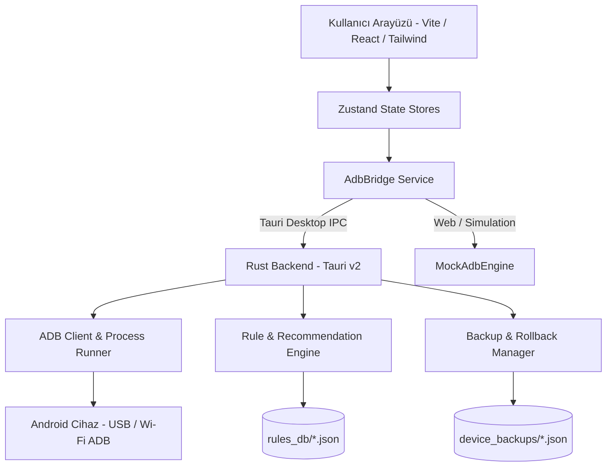

<div align="center">

  

  # ⚡ NexusTweak
  ### Modern, Güvenli ve Yüksek Performanslı Android ADB Optimizasyon ve Yönetim Aracı
  *Modern, Safe & High-Performance Android ADB Optimization & Debloat Suite*

  [](https://opensource.org/licenses/MIT)
  [](https://v2.tauri.app/)
  [](https://www.rust-lang.org/)
  [](https://react.dev/)
  [](https://www.typescriptlang.org/)
  [](https://tailwindcss.com/)
  [](https://github.com/)

  <p align="center">
    <a href="#-özellikler--features">Özellikler</a> •
    <a href="#-oem-destek-tablosu--oem-presets">OEM Desteği</a> •
    <a href="#-güvenlik-mimarisi--safety-first">Güvenlik</a> •
    <a href="#-kurulum--quick-start">Kurulum</a> •
    <a href="#-simülasyon-modu--mock-mode">Mock Modu</a> •
    <a href="#-katkıda-bulunma--contributing">Katkı</a>
  </p>

</div>

---

## 📖 Proje Hakkında (About The Project)

**NexusTweak**, Android cihazlarınızı USB veya Kablosuz (Wi-Fi) ADB üzerinden derinlemesine analiz eden, gereksiz üretici şişkinliklerini (bloatware/telemetri) güvenle temizleyen, ekran akıcılığı ve sistem animasyonlarını optimize eden açık kaynaklı bir masaüstü uygulamasıdır.

Tüm işlemler öncesinde **otomatik anlık görüntü (snapshot)** alınır ve tek tıkla **Geri Alma (Rollback)** imkanı sunulur. Kritik işletim sistemi bileşenleri için katı bir **Whitelist** mekanizması devrededir.

---

## ✨ Özellikler (Key Features)

### 🔍 1. Derin Donanım ve Yazılım Analizi (Deep Diagnostics)
- **Yonga Seti & İşlemci:** SoC platformu, CPU mimarisi (`arm64-v8a`), üretici ve model kod adı.
- **Ekran Telemetrisi:** Panel çözünürlüğü, piksel yoğunluğu (DPI), aktif yenileme hızı ve desteklenen dinamik panel hızları (60Hz / 90Hz / 120Hz / 144Hz).
- **Batarya ve Sıcaklık Monitörü:** `dumpsys battery` üzerinden anlık çekirdek sıcaklığı (°C), voltaj (V), sağlık durumu ve şarj kaynağı.
- **Sistem Güvenlik Durumu:** Root denetimi, SELinux durumu (*Enforcing/Permissive*), Android ve SDK sürümü, Güvenlik yaması tarihi.

### ⚡ 2. Kural & Optimizasyon Motoru (Tweak Engine)
- **Arayüz ve Hız:** Pencere, geçiş ve animatör süre ölçeklerini 0.5x veya 0.0x yaparak gecikmesiz tepki süresi.
- **120Hz Akıcılık Kilidi:** `min_refresh_rate` değerini `peak_refresh_rate` ile eşitleyerek kaydırma esnasında 60Hz'e düşüşü engelleme.
- **Gizlilik ve Güvenli DNS:** Cloudflare (1.1.1.1 DoH) ve AdGuard Reklam Engelleyici DoT DNS atama.
- **Pil & Arka Plan:** Agresif Doze derin uyku optimizasyonu ile bekleme süresi pil tasarrufu.
- **Wi-Fi Tarama:** Gecikmeleri azaltmak için arka plan Wi-Fi kısıtlamalarını optimize etme.

### 🗑️ 3. Güvenli Debloat Yöneticisi (Debloat Hub)
- Uygulamalar risk seviyelerine göre sınıflandırılmıştır:
  - 🟢 **Safe:** Sistem kararlılığını etkilemeyen reklam, tanıtım ve telemetri servisleri.
  - 🟡 **Moderate:** Belirli üretici fonksiyonlarını (Samsung Pay, Joyose vb.) içeren servisler.
  - 🔴 **Advanced:** Dikkatle incelenmesi gereken ileri düzey paketler.
- `--user 0` standardı ile ROM bölüntüsünü bozmadan kullanıcı alanında güvenli devre dışı bırakma.
- **Toplu İşlem Barı:** Seçilen tüm paketleri tek tıkla debloat edebilme.

### 🛡️ 4. 1-Click Rollback & Güvenlik (Safety-First)
- **Otomatik Anlık Durum Kaydı:** Herhangi bir ayar uygulanmadan önce cihazın `global`, `system`, `secure` ayarları ve devre dışı paketleri `device_backups/<device_id>_<timestamp>.json` dosyasına kaydedilir.
- **Tek Tıkla Geri Yükleme:** Tek bir butonla cihazı optimizasyon öncesindeki birebir durumuna döndürme.
- **Kritik Whitelist:** `SystemUI`, `Launcher`, `Dialer/Acil Arama`, `Google Play Services`, `KeyChain` ve `Settings` paketlerinin silinmesini engelleyen kilit koruması.

### 💻 5. Etkileşimli ADB Terminali & Hazır Şablonlar
- Canlı ANSI renkli log akışı.
- Sık kullanılan teşhis komutları için hazır şablon butonları (`dumpsys battery`, `wm size`, `getprop` vb.).

### 🎮 6. Donanım Simülasyon Modu (Mock Device Mode)
- Fiziksel Android cihaz bağlı olmadığında bile arayüzü, kuralları ve geri yükleme mantığını test etmek için **Galaxy S24 Ultra**, **Xiaomi 14 Pro** ve **Pixel 8 Pro** simülasyon profilleri.

---

## 📱 OEM Destek Tablosu (Supported OEM Presets)

| Üretici / Arayüz | Özel Debloat & Tweakler | Risk Etiketi | Durum |
| :--- | :--- | :--- | :---: |
| **Samsung One UI** | Bixby Voice/Agent, GOS Bypass, Knox Analytics, RAM Plus Disable, Samsung Pay | `Safe` / `Moderate` | ✅ Aktif |
| **Xiaomi HyperOS / MIUI** | MSA (System Ads), Joyose Throttler, GetApps Store, Wallpaper Carousel, Mi Video | `Safe` / `Moderate` | ✅ Aktif |
| **Google Pixel** | Pixel Tips, Sound Search/Now Playing, Device Health Services, Columbus Back Tap | `Safe` / `Moderate` | ✅ Aktif |
| **Generic AOSP** | 0.5x Animasyonlar, 120Hz Force Peak, AdGuard/Cloudflare DNS, Agresif Doze | `Safe` / `Moderate` | ✅ Aktif |

---

## 🏗️ Mimari Şema (Architecture)



---

## 🚀 Kurulum ve Başlatma (Quick Start)

### Gereksinimler (Prerequisites)
- [Node.js](https://nodejs.org/) (v18 veya üstü)
- [Rust & Cargo](https://www.rust-lang.org/tools/install) (Tauri v2 derlemesi için)
- Android Cihazda **Geliştirici Seçenekleri** ve **USB Hata Ayıklama (USB Debugging)** açık olmalıdır.

### 1. Depoyu Klonlayın
```bash
git clone https://github.com/burakzdgn/NexusTweak.git
cd NexusTweak
```

### 2. Bağımlılıkları Yükleyin
```bash
npm install
```

### 3. Geliştirme Modunda Çalıştırın

#### A) Web & Simülasyon Modu (Tarayıcıda Hızlı Önizleme)
Fiziksel cihaz olmadan simüle edilmiş donanım ile test etmek için:
```bash
npm run dev
```
> `http://localhost:1420` adresinden açılır.

#### B) Masaüstü Uygulaması Olarak Çalıştırma (Tauri + Gerçek ADB)
```bash
npm run tauri dev
```

### 4. Üretim Paketi Oluşturma (Production Build)
```bash
npm run tauri build
```
> Derlenen kurulum dosyaları `src-tauri/target/release/bundle/` altında oluşturulur (`.msi`, `.exe`, `.dmg` veya `.deb`).

---

## 🔒 Güvenlik Felsefesi (Safety Philosophy)

> [!IMPORTANT]
> NexusTweak **"Önce Güvenlik"** prensibiyle inşa edilmiştir:
> 1. **Salt Okunur / Geri Alınabilir:** Sistem bölüntüsündeki dosyalar silinmez, yalnızca mevcut kullanıcı (`user 0`) için askıya alınır.
> 2. **Zorunlu Yedek:** Tweak veya debloat işlemlerinden önce otomatik durum yedeği alınır.
> 3. **Whitelist Koruma Kalkanı:** Cihazın açılmasını engelleyebilecek çekirdek servisler listeden çıkarılamaz.

---

## 📁 Proje Dosya Yapısı (File Structure)

```
NexusTweak/
├── src-tauri/                 # Rust Backend (Tauri v2)
│   ├── Cargo.toml             # Rust bağımlılıkları
│   ├── tauri.conf.json        # Tauri pencere ve güvenlik ayarları
│   ├── rules_db/              # OEM ve AOSP optimizasyon kuralları JSON veritabanı
│   │   ├── generic_tweaks.json
│   │   ├── samsung_oneui.json
│   │   ├── xiaomi_miui.json
│   │   ├── google_pixel.json
│   │   └── system_whitelist.json
│   └── src/
│       ├── main.rs            # Windows alt sistem giriş noktası
│       ├── lib.rs             # Tauri command invoke yöneticisi
│       ├── models.rs          # Tip ve veri yapıları (Rust structs)
│       ├── adb/               # ADB client, parser ve scanner fonksiyonları
│       └── rules/             # Kural eşleme ve snapshot/rollback yöneticisi
├── src/                       # Frontend (React + TypeScript + Tailwind)
│   ├── components/
│   │   ├── dashboard/         # Donanım kartı, göstergeler, sağlık skoru
│   │   ├── tweaks/            # Tweak kartları, kategori ve risk filtreleri
│   │   ├── debloat/           # Paket listesi, arama, Whitelist modalı
│   │   ├── backup/            # Yedek listesi, JSON diff inceleyici
│   │   ├── terminal/          # Canlı ADB terminali ve hazır şablonlar
│   │   ├── settings/          # Wi-Fi ADB, platform-tools ve mock seçici
│   │   └── layout/            # Sidebar, Header ve BatchActionBar
│   ├── stores/                # Zustand State Stores (Device, Tweaks, Debloat, Logs)
│   ├── services/              # AdbBridge ve MockAdbEngine
│   └── App.tsx                # Ana uygulama bileşeni
```

---

## 🤝 Katkıda Bulunma (Contributing)

Projeye katkıda bulunmaktan mutluluk duyarız!
1. Bu depoyu Fork'layın (`Fork`).
2. Yeni bir özellik dalı oluşturun (`git checkout -b feature/YeniKural`).
3. Değişikliklerinizi commit edin (`git commit -m 'feat: Samsung yeni debloat kuralları eklendi'`).
4. Dalınıza push yapın (`git push origin feature/YeniKural`).
5. Bir **Pull Request (PR)** açın.

Yeni bir cihaz üreticisi kuralı eklemek için `src-tauri/rules_db/` altındaki ilgili JSON dosyasına şemaya uygun yeni bir nesne eklemeniz yeterlidir.

---

## 📄 Lisans (License)

Bu proje [MIT Lisansı](LICENSE) altında lisanslanmıştır. Detaylar için `LICENSE` dosyasına bakabilirsiniz.

---

<div align="center">
  <sub>NexusTweak ile cihazınızın kontrolünü elinize alın. Geliştirici ve Android topluluğu için özenle tasarlandı.</sub>
</div>
