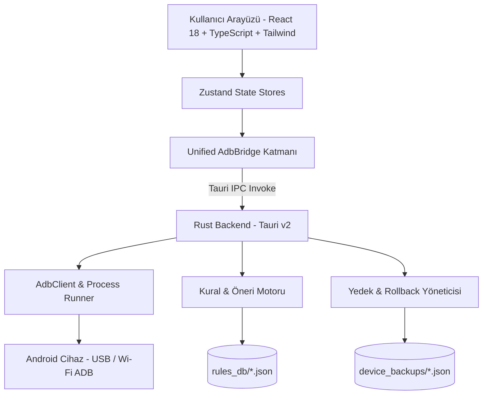

<div align="center">

  

  # ⚡ NexusTweak (Türkçe Dokümantasyon)
  ### Modern, Güvenli ve Yüksek Performanslı Android ADB Optimizasyon ve Yönetim Aracı

  <p align="center">
    <strong><a href="./README.md">🇬🇧 English Version</a></strong> •
    <strong><a href="#-türkçe">🇹🇷 Türkçe</a></strong>
  </p>

  [](https://opensource.org/licenses/MIT)
  [](https://v2.tauri.app/)
  [](https://www.rust-lang.org/)
  [](https://react.dev/)
  [](https://www.typescriptlang.org/)
  [](https://tailwindcss.com/)
  [](https://github.com/burakzdgn/NexusTweak)

  <p align="center">
    <a href="#-özellikler">Özellikler</a> •
    <a href="#-oem-destek-tablosu">OEM Desteği</a> •
    <a href="#-mimari">Mimari</a> •
    <a href="#-kurulum-ve-başlatma">Kurulum</a> •
    <a href="#-güvenlik-ve-geri-alma-felsefesi">Güvenlik</a> •
    <a href="#-katkıda-bulunma">Katkı</a>
  </p>

</div>

---

<a name="türkçe"></a>
## 📖 Proje Hakkında

**NexusTweak**, Android cihazlarınızı USB veya Kablosuz (Wi-Fi) ADB üzerinden derinlemesine analiz eden, gereksiz üretici şişkinliklerini (bloatware ve telemetri) güvenle temizleyen, ekran akıcılığı ve sistem animasyonlarını optimize eden açık kaynaklı bir masaüstü uygulamasıdır.

Tüm işlemler öncesinde **otomatik anlık görüntü (snapshot)** alınır, değişiklik farkları (diff) incelenebilir ve tek tıkla **Geri Alma (Rollback)** imkanı sunulur.

---

## ✨ Temel Özellikler

### 🔍 1. Derin Donanım ve Telemetri Analizi
- **Yonga Seti & İşlemci:** SoC platformu, CPU mimarisi (`arm64-v8a`), üretici, model ve derleme kimliği.
- **Ekran Telemetrisi:** Panel çözünürlüğü, piksel yoğunluğu (DPI), aktif yenileme hızı ve dinamik panel hızları (60Hz / 90Hz / 120Hz / 144Hz).
- **Batarya ve Sıcaklık Monitörü:** `dumpsys battery` üzerinden çekirdek batarya sıcaklığı (°C), voltaj (V), sağlık durumu ve şarj kaynağı.
- **Sistem Güvenlik Durumu:** Root denetimi (Magisk/KernelSU), SELinux durumu (*Enforcing/Permissive*), Android ve SDK sürümü, Güvenlik yaması tarihi.

### ⚡ 2. Kural & Optimizasyon Motoru
- **Arayüz ve Hız:** Pencere, geçiş ve animatör süre ölçeklerini 0.5x veya 0.0x yaparak gecikmesiz tepki süresi.
- **120Hz/144Hz Akıcılık Kilidi:** `min_refresh_rate` değerini `peak_refresh_rate` ile eşitleyerek kaydırma esnasında 60Hz'e düşüşü engelleme.
- **Gizlilik ve Güvenli DNS:** Cloudflare (1.1.1.1 DoH) ve AdGuard Reklam Engelleyici DoT DNS atama.
- **Pil & Arka Plan:** Agresif Doze derin uyku optimizasyonu ile bekleme süresi pil tasarrufu.
- **Wi-Fi Tarama:** Gecikmeleri azaltmak için arka plan Wi-Fi kısıtlamalarını optimize etme.

### 🗑️ 3. Güvenli Debloat Yöneticisi
- **Risk Sınıflandırması:**
  - 🟢 **Safe:** Sistem kararlılığını etkilemeyen reklam, tanıtım ve telemetri servisleri.
  - 🟡 **Moderate:** Belirli üretici fonksiyonlarını (Samsung Pay, Joyose vb.) içeren servisler.
  - 🔴 **Advanced:** Dikkatle incelenmesi gereken ileri düzey paketler.
- **Zararsız Devre Dışı Bırakma:** `--user 0` standardı ile ROM bölüntüsünü bozmadan kullanıcı alanında güvenli devre dışı bırakma.
- **Toplu İşlem Barı:** Seçilen tüm paketleri tek tıkla debloat edebilme.

### 🛡️ 4. 1-Click Rollback & Detaylı Diff İnceleyici
- **Otomatik Anlık Durum Kaydı:** Herhangi bir ayar uygulanmadan önce cihaz adı, tarih ve ayar değerleri `device_backups/<device_id>_<timestamp>.json` dosyasına kaydedilir.
- **Detaylı Diff İnceleyici:** Geri yükleme yapıldığında hangi ayarların ve hangi paketlerin eski haline döneceğini açıkça gösterir.
- **Kritik Whitelist:** `SystemUI`, `Launcher`, `Dialer`, `Google Play Services`, `KeyChain` ve `Settings` paketlerinin silinmesini engelleyen kilit koruması.

### 💻 5. Etkileşimli ADB Terminal Çekmecesi
- Sağ üstteki **Terminal Konsolu** butonuna basıldığında ekranın altından yukarı doğru açılan interaktif terminal çekmecesi.
- Canlı ANSI renkli log akışı ve hazır teşhis komutları (`dumpsys battery`, `wm size`, `getprop`, `pm list`).

### ⬇️ 6. 1-Tıkla Otomatik Google ADB İndirici
- Sistemde ADB kurulu olmadığında resmi Google Android sunucularından platform-tools paketini tek tıkla indirip otomatik yapılandırır.

### 🌐 7. Çoklu Dil Desteği (i18n)
- Arayüz üzerinden **Türkçe (TR)** ve **English (EN)** dilleri arasında anında geçiş.

---

## 📱 OEM Destek Tablosu

| Üretici / Arayüz | Özel Debloat & Tweakler | Risk Seviyesi | Durum |
| :--- | :--- | :--- | :---: |
| **Samsung One UI** | Bixby Voice/Agent, GOS Bypass, Knox Analytics, RAM Plus Disable, Samsung Pay | `Safe` / `Moderate` | ✅ Destekleniyor |
| **Xiaomi HyperOS / MIUI** | MSA (System Ads), Joyose Throttler, GetApps Store, Wallpaper Carousel, Mi Video | `Safe` / `Moderate` | ✅ Destekleniyor |
| **Google Pixel** | Pixel Tips, Sound Search/Now Playing, Device Health Services, Columbus Gestures | `Safe` / `Moderate` | ✅ Destekleniyor |
| **Generic Android AOSP** | 0.5x Animasyonlar, 120Hz Force Peak, AdGuard/Cloudflare DNS, Agresif Doze | `Safe` / `Moderate` | ✅ Destekleniyor |

---

## 🏗️ Mimari



---

## 🚀 Kurulum ve Başlatma

### Gereksinimler
- [Node.js](https://nodejs.org/) (v18 veya üstü)
- [Rust & Cargo](https://www.rust-lang.org/tools/install) (Tauri v2 derlemesi için)
- Android Cihazda **Geliştirici Seçenekleri** ve **USB Hata Ayıklama (USB Debugging)** açık olmalıdır.

### 1. Depoyu Klonlayın
```bash
git clone https://github.com/burakzdgn/NexusTweak.git
cd NexusTweak
```

### 2. Bağımlılıkları Yükleyin
```bash
npm install
```

### 3. Geliştirme Modunda Çalıştırın

#### Web Önizleme Modu
```bash
npm run dev
```
> Tarayıcınızda `http://localhost:1420` adresini açın.

#### Masaüstü Uygulaması Olarak Çalıştırma (Tauri + Rust)
```bash
npm run tauri dev
```

### 4. Üretim Paketi Oluşturma
```bash
npm run tauri build
```
> Kurulum dosyaları `src-tauri/target/release/bundle/` altında oluşturulur (`.msi`, `.exe`, `.dmg`, `.deb`).

---

## 🔒 Güvenlik ve Geri Alma Felsefesi

> [!IMPORTANT]
> NexusTweak **"Önce Güvenlik"** prensibiyle inşa edilmiştir:
> 1. **Salt Okunur / Geri Alınabilir:** Paketler `pm disable-user --user 0` ile devre dışı bırakılır, sistem bölüntüsündeki orijinal dosyalar korunur.
> 2. **Zorunlu Snapshot:** Her işlem öncesinde tarihli ve cihaz modelli tam durum yedeği kaydedilir.
> 3. **Whitelist Kalkanı:** Cihazın açılmasını sağlayan çekirdek servisler listeden silinemez.

---

## 🤝 Katkıda Bulunma

Katkılarınızı memnuniyetle kabul ediyoruz!
1. Depoyu Fork'layın (`Fork`).
2. Yeni özellik dalı oluşturun (`git checkout -b feature/YeniKural`).
3. Değişikliklerinizi commit edin (`git commit -m 'feat: yeni debloat kuralları eklendi'`).
4. Dalınıza push yapın (`git push origin feature/YeniKural`).
5. Bir **Pull Request (PR)** açın.

Yeni bir OEM kuralı eklemek için `src-tauri/rules_db/` altındaki ilgili JSON dosyasına ekleme yapabilirsiniz.

---

## 📄 Lisans

Bu proje [MIT Lisansı](LICENSE) altında lisanslanmıştır.

---

<div align="center">
  <sub>NexusTweak ile cihazınızın tam kontrolünü elinize alın. Açık kaynak topluluğu için özenle geliştirildi.</sub>
</div>
